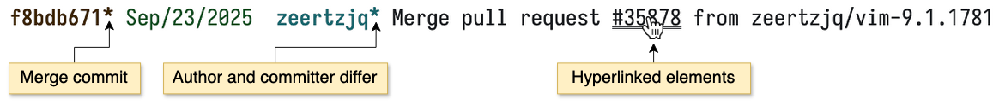

# git-timeline

Timeline is a **drop-in replacement** for git-log which improves the readability of its output.



## Usage

Timeline is a **drop-in replacement** for `git log`. So `git timeline` accepts ANY option
supported by [git-log](https://git-scm.com/docs/git-log).

Timeline has very few additional options. Learn them through `git timeline -h`.

## Features

- Commit hashes, PR numbers and issue numbers are formatted as terminal
  [hyperlinks](https://gist.github.com/egmontkob/eb114294efbcd5adb1944c9f3cb5feda) to the hosting provider.
- Indication of some commit characteristics: An asterisk next to the hash means the commit is a merge; next
  to the author name means the author and committer have different names.
- One-line format including date (%ad) and author (%an).
- Pass-through of all opts/args to git-log.

## Limitations

- This in a commit subject line breaks the format: `</hernancerm.git-timeline.subject-line>`
- Not tested in any way in Windows.

## Installation

> [!NOTE]
> Only macOS is supported through Homebrew. For Linux see the section below
> [Build from source](#build-from-source).

1. Add the Homebrew tap:

```text
brew tap hernancerm/formulas https://github.com/hernancerm/formulas
```

2. Install Timeline:

```text
brew install git-timeline
```

3. Verify installation by executing in a git repo:

```
git timeline
```

Optional: `~/.gitconfig`: Create the below alias to shorten `git timeline` to `git l`.

```text
[alias]
    l = timeline
```

## Upgrade

1. Fetch the newest version of all formulas.

```text
brew update
```

2. Upgrade Timeline.

```text
brew upgrade git-timeline
```

## Configuration

- Date format: Use the option `--date` as defined in the
  [documentation of git-log](https://git-scm.com/docs/git-log#Documentation/git-log.txt---dateformat).
- Pager command: Use the env var `GIT_PAGER`, `core.pager` from gitconfig or env var `PAGER`.

## Completions

Completions only work for `git timeline`, not `git-timeline`.

Use a command below to sync the completions of `git timeline` when you upgrade Git.

### Zsh

If your Git is installed with Homebrew:

```text
curl -L https://raw.githubusercontent.com/hernancerm/git-timeline/refs/heads/main/completions/_git_timeline.generate.zsh \
  | zsh /dev/stdin > $(brew --prefix)/share/zsh/site-functions/_git_timeline
```

## Build from source

The project is written in Java 25.

The steps below should work for macOS (arm64 and x86) and Linux (arm64 and x86).

### Native binary

GraalVM Native Image is used to compile Java to a native binary.

1. Download the Java 25 JDK provided by GraalVM.

    Either do it manually through the website: https://www.graalvm.org/downloads/

    Or use SDKMAN! (https://sdkman.io/): `sdk install java 25.0.2-graal`

2. Set the env vars `JAVA_HOME` and `GRAALVM_HOME` (same value as JAVA_HOME).

3. On a clone of this repo run `make bin`.

The binary is created at `./target/git-timeline`.

Execute it with `./target/git-timeline`.

### Uber JAR (executable JAR)

1. Download a Java 25 JDK.

2. Set the env var `JAVA_HOME`.

3. On a clone of this repo run `make uber`.

The uber JAR is created at `./target/git-timeline.jar`.

Execute it with `java -jar ./target/git-timeline.jar`.

## Versioning

Timeline does not follow semantic versioning.

- `x.y`. Here is what an increment on each part means:
  - `x`: At least one breaking change is included in the release.
  - `y`: Only non-breaking changes, of any kind, are included in the release.
